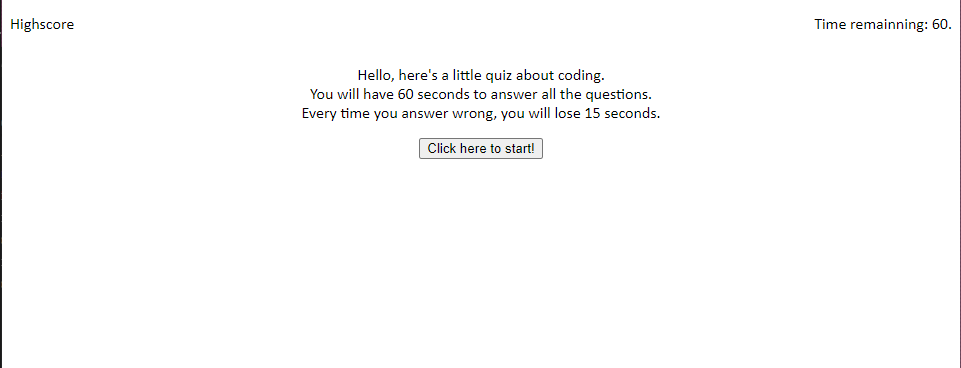

# Codingquiz

## Description

This is my 4th project of this bootcamp. It is a small quiz about javascript. I made the webapplication from scratch.

## Installation

N/A

## Usage

Please go to https://valerigionetnoel.github.io/Codingquiz/ to use my webapplication.

To use the website, simply click on the click here to start button. You will be presented with question. Click on the answer to go to the next question. Answer wrong and lose 15 seconds on your timer. At the end of the quiz, you can enter your initials and it will be save in the local storage.

## Credit

N/A

## License

Refer to the LICENSE in the repo.